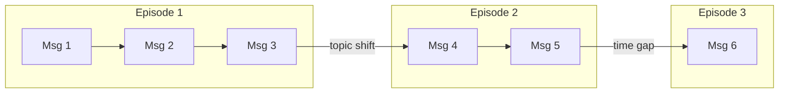

# Episodes

Episodes are coherent conversation segments — the intermediate representation between raw messages and extracted knowledge.

## Segmentation

`BoundaryDetector` analyzes message sequences to find natural break points:

- **Topic shifts** — The conversation moves to a different subject
- **Intent changes** — The user switches from asking questions to giving instructions
- **Time gaps** — A configurable silence gap (default: 30 minutes)



### Configuration

```python
memory = Memory(
    # ...
    segmentation_threshold=20,  # Max messages per episode
    time_gap_minutes=30,        # Time gap triggers new episode
)
```

## Generation

`EpisodeGenerator` transforms each message group into a structured episode:

- **Title** — Concise label (e.g., "User's Work Background")
- **Content** — Third-person narrative summary of what happened

The narrative format preserves context that individual facts would lose. Episodes are indexed for retrieval alongside extracted knowledge.

## Merging

When `enable_episode_merging=True` (default), newly created episodes are compared against recent episodes by embedding similarity. If similarity exceeds `merge_similarity_threshold` (default: 0.9), episodes are merged to reduce redundancy.

This handles cases where the same topic is discussed across multiple short exchanges — instead of creating many small episodes, they consolidate into one.

```python
memory = Memory(
    # ...
    enable_episode_merging=True,
    merge_similarity_threshold=0.9,
)
```
