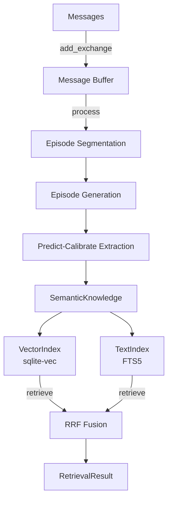

# Core Concepts

memv processes conversations through a pipeline that turns raw messages into retrievable knowledge.



## How It Works

1. **Messages** are stored immediately via `add_exchange()`. They accumulate until `process()` is called (or auto-processing triggers).

2. **[Episodes](episodes.md)** — Messages are segmented into coherent conversation groups based on topic shifts, intent changes, and time gaps. Each episode gets a narrative summary.

3. **[Predict-Calibrate](predict-calibrate.md)** — For each episode, memv predicts what it should contain based on existing knowledge, then extracts only what was unpredicted. This is the core innovation.

4. **[Bi-Temporal Validity](bi-temporal.md)** — Extracted knowledge tracks both when facts were true in the world and when memv learned them. Contradictions invalidate old facts rather than deleting them.

5. **[Retrieval](retrieval.md)** — Queries run through both vector similarity and BM25 text search, merged with Reciprocal Rank Fusion.

## Module Structure

```
src/memv/
├── memory/           # Memory class (main API)
├── processing/       # BoundaryDetector, EpisodeGenerator, PredictCalibrateExtractor
├── retrieval/        # Hybrid search with RRF
├── storage/sqlite/   # MessageStore, EpisodeStore, KnowledgeStore, VectorIndex, TextIndex
├── models.py         # Message, Episode, SemanticKnowledge, RetrievalResult
├── config.py         # MemoryConfig
└── protocols.py      # EmbeddingClient, LLMClient
```
