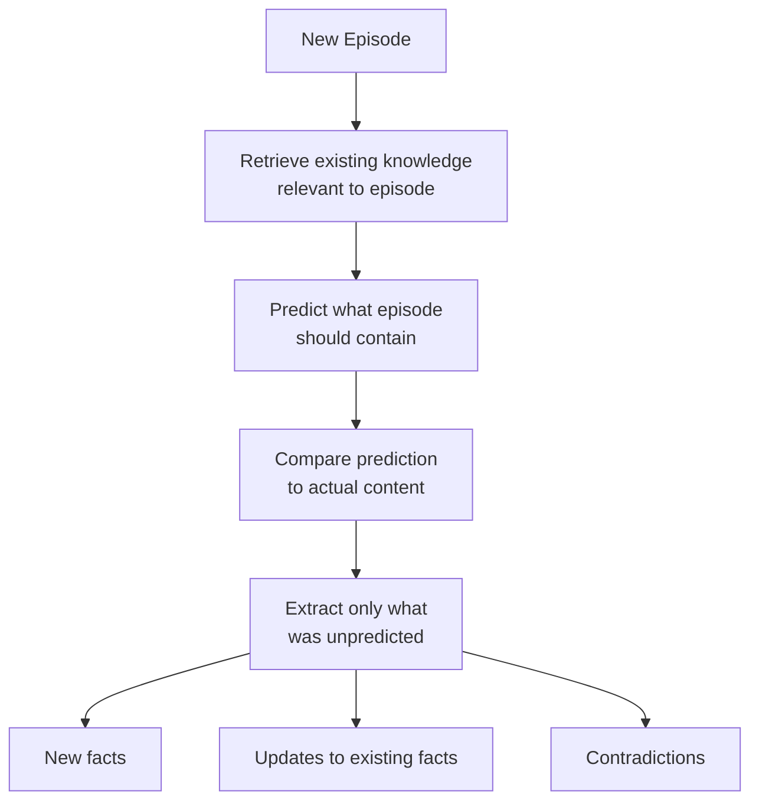

# Predict-Calibrate Extraction

The core innovation in memvee. Based on [Nemori](https://arxiv.org/abs/2508.03341).

## The Problem

Traditional memory extraction asks: *"What facts are in this conversation?"*

This extracts everything — including information you already know. Over time, your knowledge base fills with redundant entries, and retrieval degrades.

## The Approach

Predict-calibrate flips the question: *"What did I fail to predict?"*



### Step by Step

1. **Retrieve** — Find existing knowledge relevant to the new episode
2. **Predict** — Given what we already know, predict what this conversation contains
3. **Compare** — Diff the prediction against the actual episode content
4. **Extract** — Only store what the prediction missed

## What Gets Extracted

Each extracted piece of knowledge is classified:

| Type | Meaning | Example |
|------|---------|---------|
| `new` | Previously unknown information | "User works at Anthropic" |
| `update` | Revision of existing knowledge | "User now works at OpenAI" (was Anthropic) |
| `contradiction` | Conflicts with prior knowledge | "User prefers tea" (we thought coffee) |

## Why It Works

Importance emerges naturally from prediction error — without explicit LLM scoring.

- **First conversation**: Everything is unpredicted, so everything gets extracted
- **Subsequent conversations**: Only genuinely novel information survives the prediction filter
- **Repeated topics**: Already-known facts are predicted correctly and skipped

This keeps the knowledge base lean and focused on what actually matters.

## Configuration

The `max_statements_for_prediction` parameter controls how many existing knowledge statements are used during prediction. More statements = better predictions but higher token cost.

```python
memory = Memory(
    # ...
    max_statements_for_prediction=10,  # Default
)
```

See [Configuration](../advanced/configuration.md) for all options.
