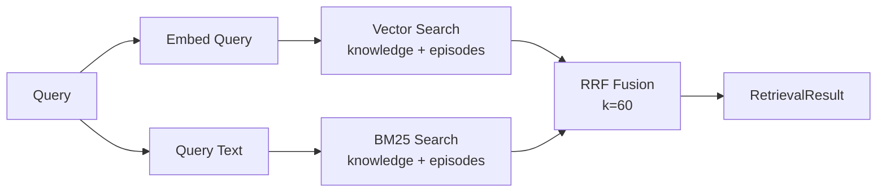

# Retrieval

memvee uses hybrid search combining vector similarity and BM25 text search, merged with Reciprocal Rank Fusion.

## How It Works



### Vector Search

The query is embedded using your `EmbeddingClient` and compared against stored embeddings via sqlite-vec. This captures semantic similarity — "Where does the user work?" matches "Employed at Anthropic" even though they share no keywords.

### BM25 Text Search

The query is also run through FTS5 full-text search. This catches exact keyword matches that vector search might miss — proper nouns, technical terms, specific numbers.

### Reciprocal Rank Fusion

Results from both searches are merged using RRF:

```
RRF_score = 1/(k + rank_vector) + 1/(k + rank_text)
```

With `k=60`, this balances both signals without either dominating. Items that rank well in both searches score highest.

## Tuning

### vector_weight

The `vector_weight` parameter (0.0 to 1.0) controls the balance:

```python
# Semantic-heavy (good for vague queries)
result = await memory.retrieve(query, user_id=uid, vector_weight=0.8)

# Keyword-heavy (good for specific terms)
result = await memory.retrieve(query, user_id=uid, vector_weight=0.2)

# Balanced (default)
result = await memory.retrieve(query, user_id=uid, vector_weight=0.5)
```

### top_k

Controls how many results to return per category:

```python
result = await memory.retrieve(query, user_id=uid, top_k=10)  # Default
```

### include_episodes

By default, retrieval searches both knowledge and episodes. Disable episode retrieval if you only want extracted facts:

```python
result = await memory.retrieve(query, user_id=uid, include_episodes=False)
```

## Output Formatting

`RetrievalResult` provides two formatting options:

### to_prompt()

Groups knowledge by source episode — designed for LLM context injection:

```markdown
## Relevant Context

### User's Work Background
_The user discussed their job at Anthropic during an initial introduction._

Key facts:
- The user works at Anthropic as a researcher
- Their focus area is AI safety, specifically interpretability

### Additional Facts
- The user prefers Python for data analysis
```

### as_text()

Simple newline-separated statements:

```
The user works at Anthropic as a researcher
Their focus area is AI safety, specifically interpretability
The user prefers Python for data analysis
```

## Embedding Cache

An optional LRU cache with TTL reduces API calls for repeated or similar queries:

```python
memory = Memory(
    # ...
    enable_embedding_cache=True,         # Default
    embedding_cache_size=1000,           # Max cached embeddings
    embedding_cache_ttl_seconds=600,     # 10 minute TTL
)
```
