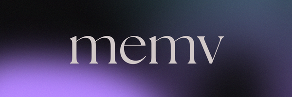
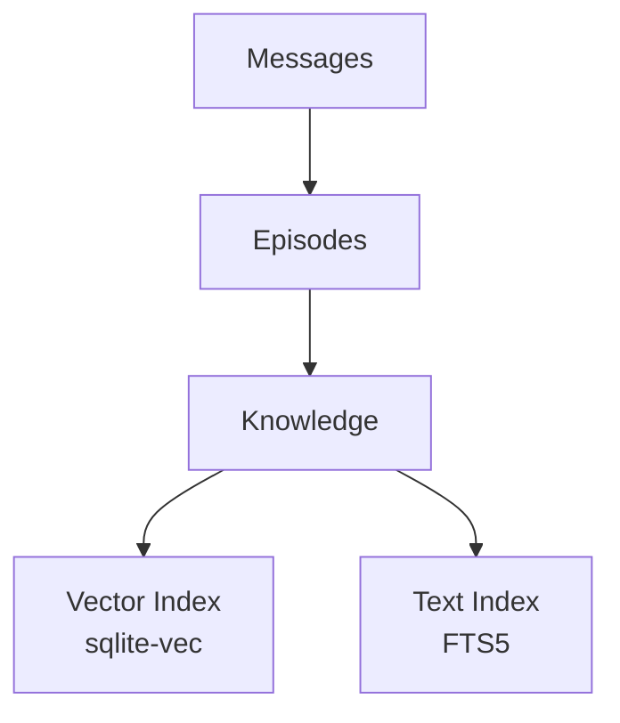

<p align="center">
  
</p>

<h1 align="center">memv</h1>

<p align="center">
  <em>Structured, temporal memory for AI agents</em>
</p>

<p align="center">
  <a href="https://pypi.org/project/memvee/"></a>
  <a href="https://www.python.org/"></a>
  <a href="https://opensource.org/licenses/MIT"></a>
  <a href="https://github.com/pydantic/pydantic-ai"></a>
</p>

---

**memv** extracts knowledge from conversations using a predict-calibrate approach: importance emerges from prediction error, not upfront LLM scoring.

## Why memv?

| Typical Approach | memv |
|------------------|--------|
| Extract all facts upfront | Extract only what we **failed to predict** |
| Overwrite old facts | **Invalidate** with temporal bounds |
| Retrieve by similarity | **Hybrid** vector + BM25 + RRF |
| Timestamps only | **Bi-temporal**: event time + transaction time |

## Quick Start

```bash
pip install memvee
```

```python
from memv import Memory
from memv.embeddings import OpenAIEmbedAdapter
from memv.llm import PydanticAIAdapter

memory = Memory(
    db_path="memory.db",
    embedding_client=OpenAIEmbedAdapter(),
    llm_client=PydanticAIAdapter("openai:gpt-4o-mini"),
)

async with memory:
    # Store conversation
    await memory.add_exchange(
        user_id="user-123",
        user_message="I just started at Anthropic as a researcher.",
        assistant_message="Congrats! What's your focus area?",
    )

    # Extract knowledge
    await memory.process("user-123")

    # Retrieve context
    result = await memory.retrieve("What does the user do?", user_id="user-123")
    print(result.to_prompt())
```

## Core Capabilities

| Capability | Description |
|------------|-------------|
| **Predict-Calibrate** | Extract only what the model failed to predict ([Nemori](https://arxiv.org/abs/2508.03341)) |
| **Bi-Temporal** | Event time + transaction time for point-in-time queries ([Graphiti](https://github.com/getzep/graphiti)) |
| **Hybrid Retrieval** | Vector similarity + BM25 text search with RRF fusion |
| **Episode Segmentation** | Automatic grouping of messages into coherent episodes |
| **Contradiction Handling** | New facts invalidate conflicting old facts, full history preserved |
| **Async Processing** | Non-blocking `process_async()` with auto-processing |
| **SQLite Default** | Zero-config with sqlite-vec for vectors and FTS5 for text |

## Architecture



See [Core Concepts](concepts/index.md) for the full breakdown.

## Framework Integration

memv works with any agent framework:

```python
class MyAgent:
    def __init__(self, memory: Memory):
        self.memory = memory

    async def run(self, user_input: str, user_id: str) -> str:
        # 1. Retrieve relevant context
        context = await self.memory.retrieve(user_input, user_id=user_id)

        # 2. Generate response with context
        response = await self.llm.generate(
            f"{context.to_prompt()}\n\nUser: {user_input}"
        )

        # 3. Store the exchange
        await self.memory.add_exchange(user_id, user_input, response)

        return response
```

See [Examples](examples/index.md) for integrations with PydanticAI, LangGraph, LlamaIndex, CrewAI, and AutoGen.

## Next Steps

- [Installation](installation.md) — Get up and running
- [Getting Started](getting-started.md) — First example and agent pattern
- [Core Concepts](concepts/index.md) — How memv works under the hood
- [API Reference](api.md) — Complete API documentation
- [Examples](examples/index.md) — Framework integrations
